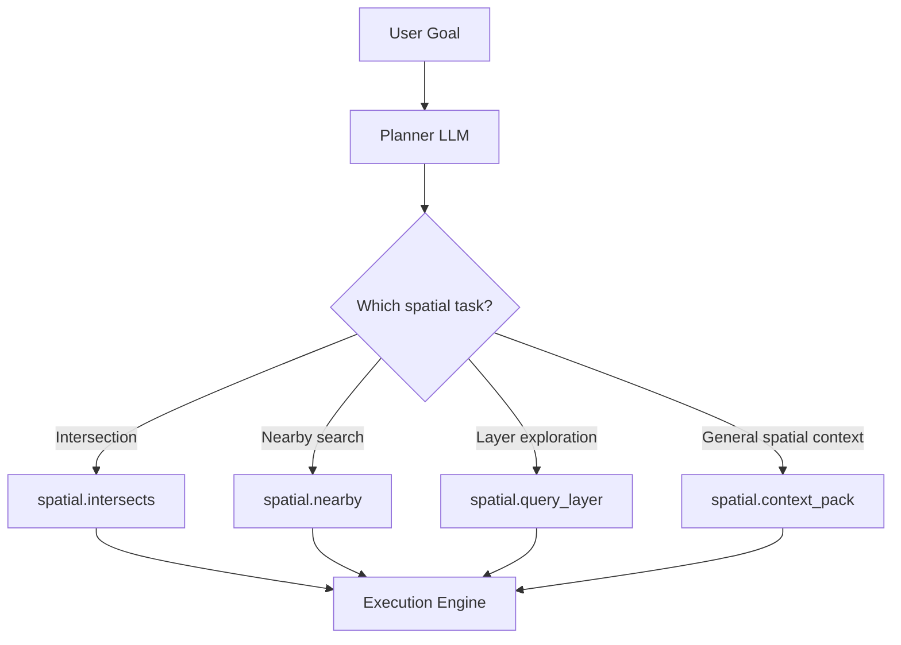
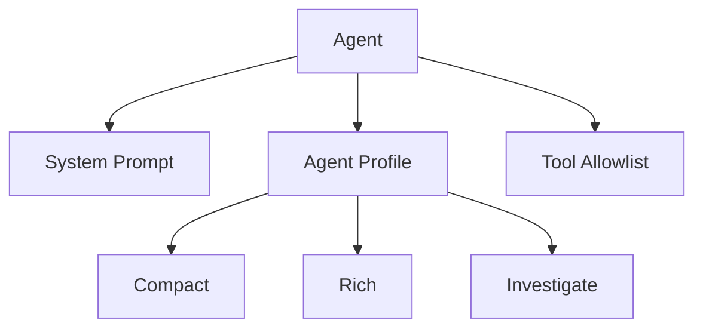
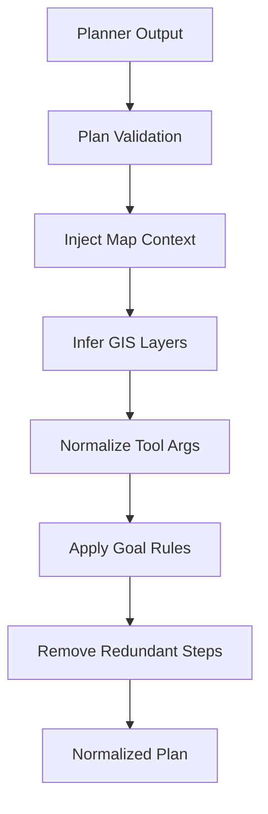
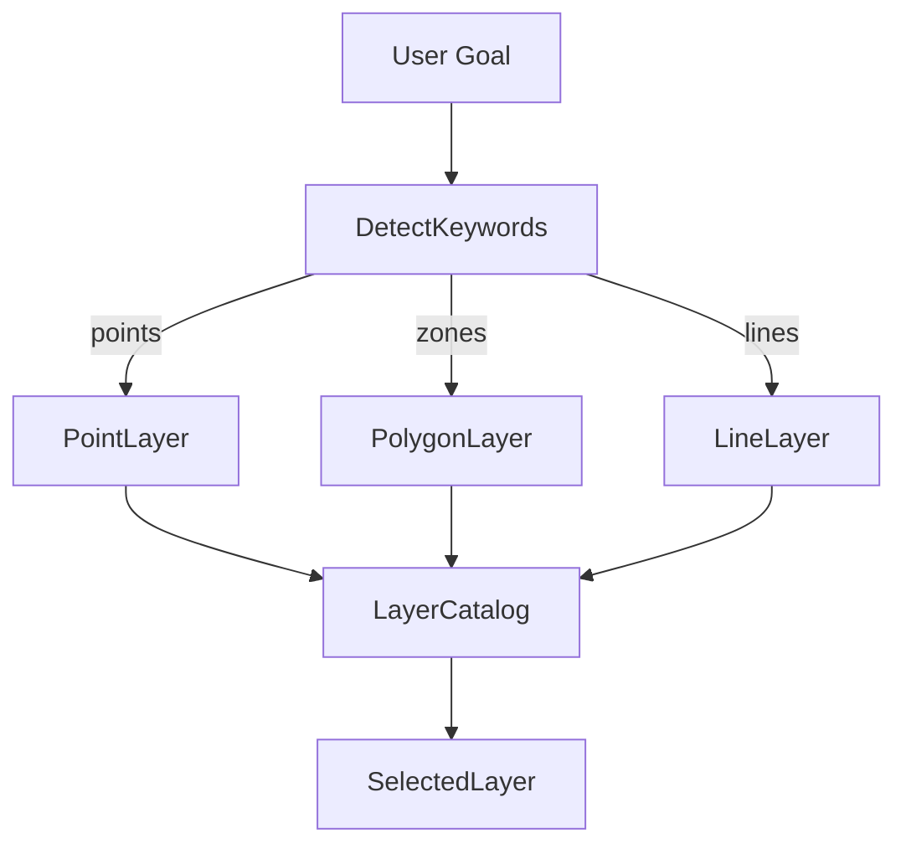
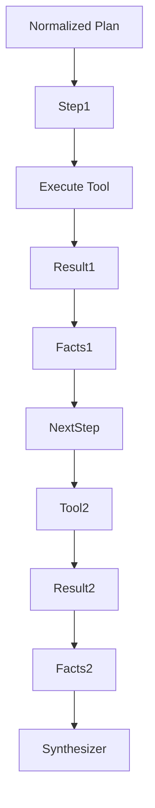
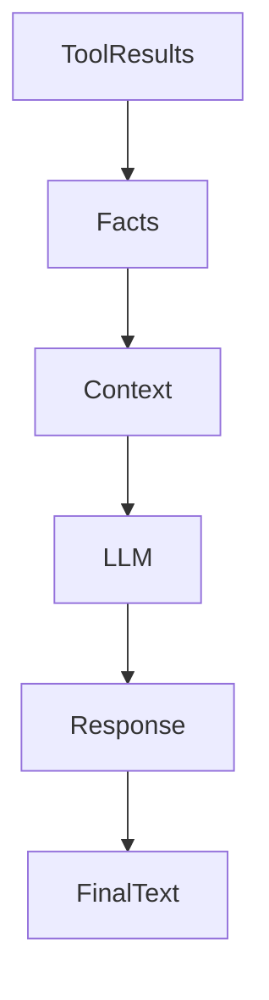
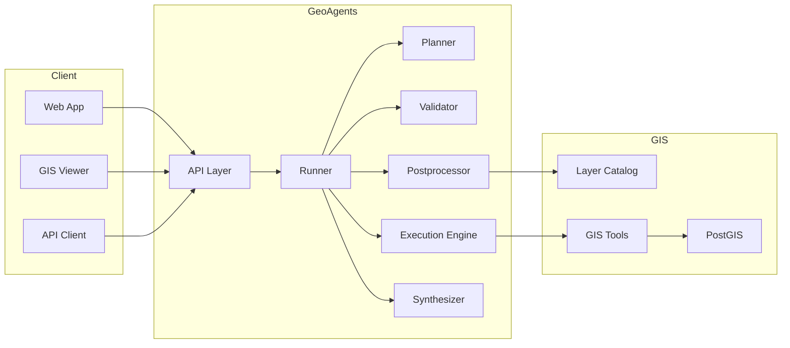
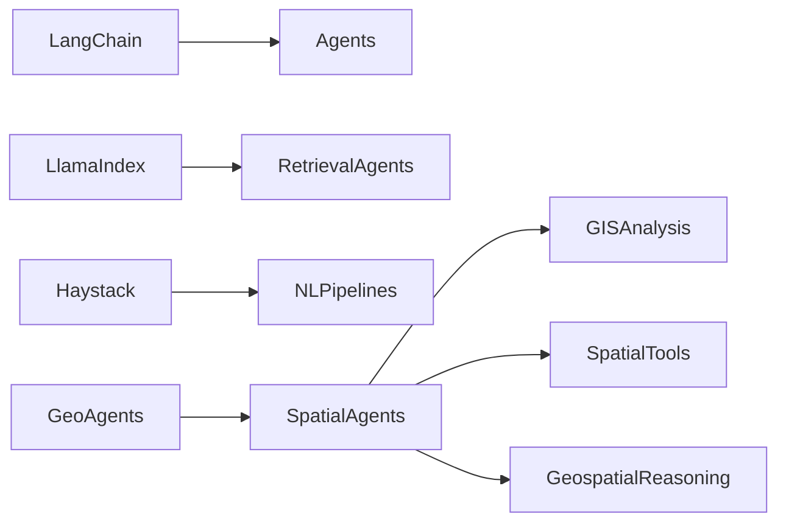
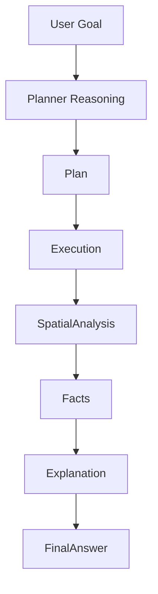

# GeoAgents Framework Diagrams

Este documento describe visualmente la arquitectura de **GeoAgents**.

Los diagramas están escritos en **Mermaid**, lo que permite renderizado automático en GitHub y sistemas de documentación.

---

# Arquitectura completa del framework

Este diagrama muestra todos los componentes principales.

```mermaid
flowchart TD

A[User / Client] --> B[GeoAgents API]

B --> C[Runner]

C --> D[Planner LLM]
D --> E[Plan Validator]

E --> F[Plan Postprocessor]

F --> G[Execution Engine]

G --> H[GIS Tools]

H --> I[Tool Results]
I --> J[Facts Extraction]

J --> K[Synthesizer LLM]

K --> L[Final Response]

C --> M[(Run Database)]

M --> L
````

---

# Pipeline de ejecución

Este diagrama muestra el **pipeline interno de un run**.

```mermaid
sequenceDiagram

participant User
participant API
participant Runner
participant Planner
participant Validator
participant Postprocessor
participant Engine
participant Tools
participant Synthesizer

User->>API: POST /agents/{id}/run
API->>Runner: create Run

Runner->>Planner: generate_plan(goal)

Planner-->>Runner: raw_plan

Runner->>Validator: validate_plan
Validator-->>Runner: validated_plan

Runner->>Postprocessor: normalize_plan
Postprocessor-->>Runner: normalized_plan

Runner->>Engine: execute_plan

Engine->>Tools: run tool
Tools-->>Engine: results

Engine-->>Runner: tool_results

Runner->>Synthesizer: build_final_text

Synthesizer-->>Runner: final_text

Runner-->>API: run completed

API-->>User: response
```

---

# Planner → Tools interaction

Este diagrama explica cómo el **planner decide qué tools usar**.



---

# Arquitectura interna del Agent

Este diagrama muestra los componentes de un agente.



Los perfiles modifican el comportamiento del postprocessor.

---

# Plan Postprocessor Logic

Este diagrama explica el papel del **postprocessor**, que es una de las piezas clave del framework.



---

# GIS Layer Inference

El sistema puede inferir capas automáticamente.



Esto permite que el agente **no tenga que conocer los nombres exactos de las capas**.

---

# Tool Execution Engine

El execution engine ejecuta los pasos del plan.



---

# Synthesizer Architecture

El synthesizer convierte los resultados en texto.



El synthesizer utiliza:

* facts estructurados
* resultados de tools
* el goal original

---

# Component Map (similar a frameworks OSS)

Este diagrama muestra la arquitectura del framework como sistema modular.



---

# Conceptual Comparison

GeoAgents se sitúa en la siguiente categoría de frameworks.



GeoAgents introduce **razonamiento geoespacial estructurado**.

---

# Resumen conceptual



---

# Conclusión

GeoAgents combina:

* agentes IA
* herramientas GIS
* inferencia espacial
* síntesis explicativa

para crear un **motor de análisis geoespacial autónomo y extensible**.

