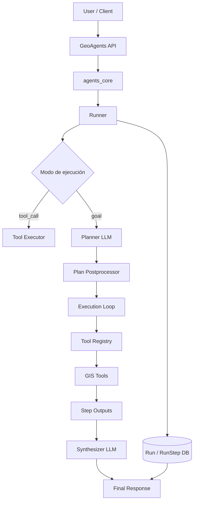
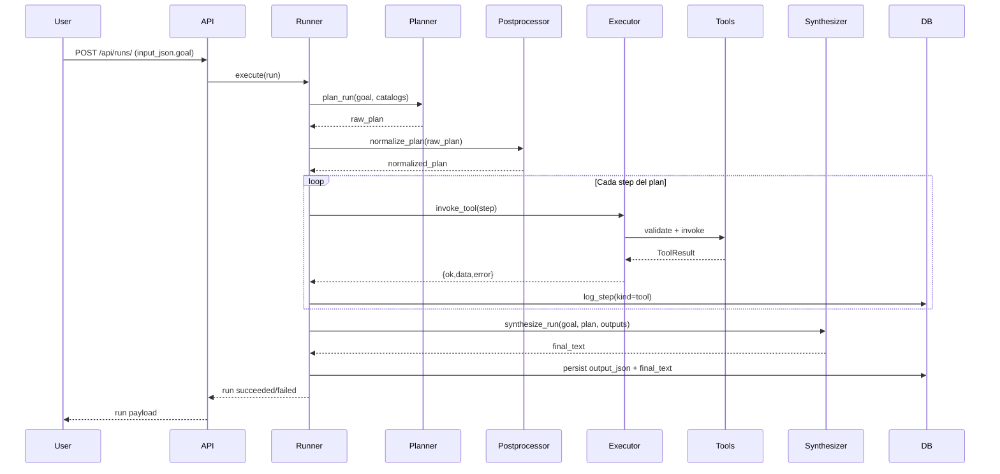
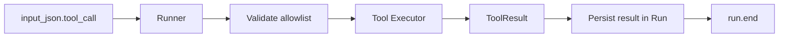
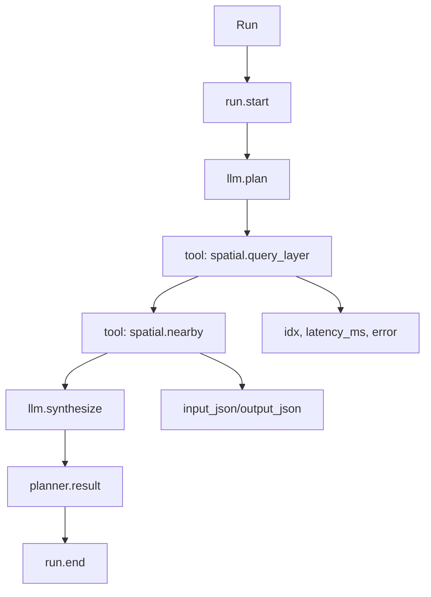

# GeoAgents Framework Diagrams

Este documento describe visualmente la arquitectura actual de **GeoAgents** y los cambios recientes del runner:

- ejecución en dos modos (`tool_call` directo y `goal` + planner)
- planes multi-step con `id`, `depends_on`, `hypothesis`, `on_fail`
- referencias entre pasos (`$step:<id>.<path>`)
- trazabilidad completa vía `RunStep`

---

# Arquitectura completa del framework



---

# Pipeline de ejecución (goal + planner)



---

# Pipeline alternativo (tool_call directo)



---

# Plan multi-step y dependencias

```mermaid
flowchart TD

S1[s1: spatial.query_layer]\nrequired=true --> S2[s2: spatial.nearby]\ndepends_on=[s1]
S2 --> S3[s3: spatial.intersects]\ndepends_on=[s1,s2]
S3 --> F[final]

R1[args usa $step:s1.data...] --> S2
R2[on_fail=continue/abort] --> S2
R3[hypothesis] --> S2
```

---

# Trazabilidad de ejecución (RunStep)



Este registro ordenado permite auditoría y depuración paso a paso.
