# GeoAgents Framework Diagrams

Este documento describe visualmente la arquitectura de **GeoAgents**.

Los diagramas están escritos en **Mermaid**, lo que permite renderizado automático en GitHub y sistemas de documentación.

---

# Arquitectura completa del framework

Este diagrama muestra los componentes principales del framework en su estado actual.

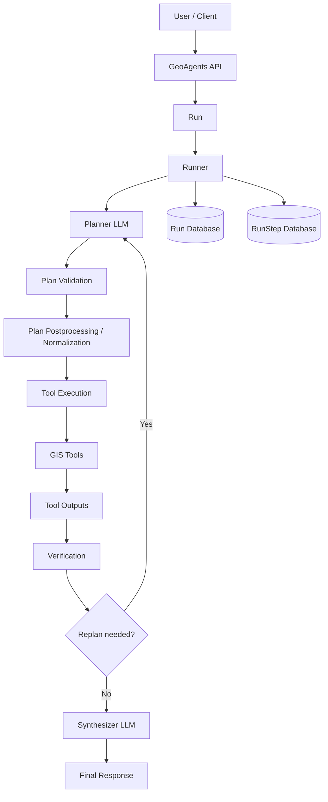

---

# Pipeline real de un run

Este diagrama muestra el pipeline interno actual.

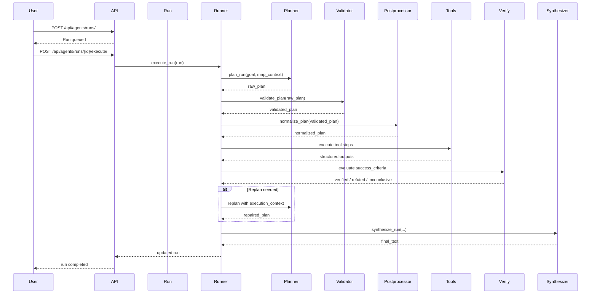

---

# Ciclo lógico del agente

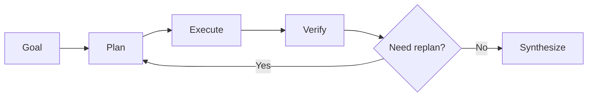

---

# Planner -> Tools interaction

Este diagrama explica cómo el planner decide qué tools usar según el objetivo.

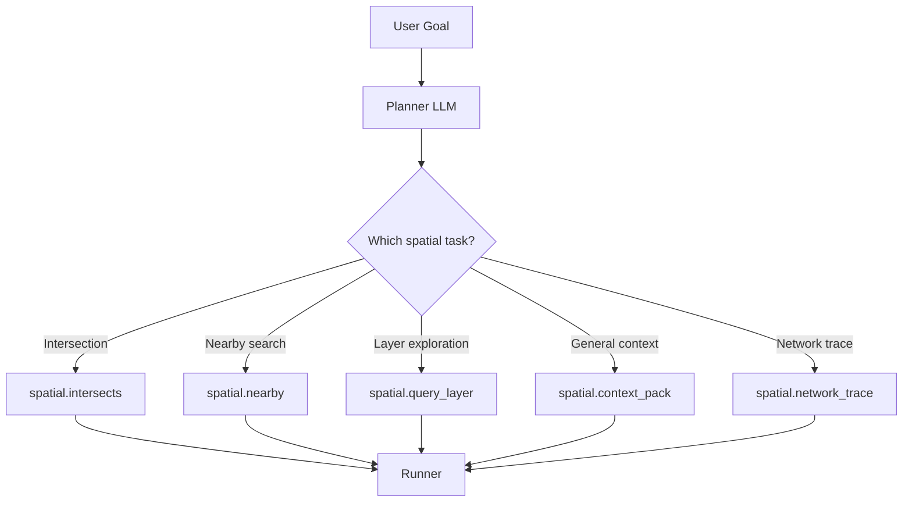

---

# Arquitectura interna del Agent

Este diagrama muestra los componentes de un agente.

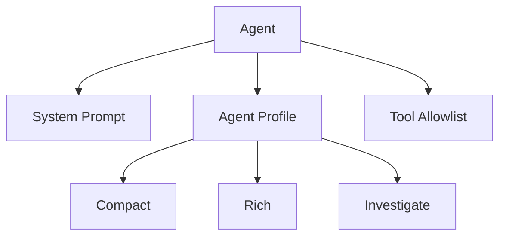

Los perfiles modifican la profundidad del plan y la agresividad del análisis.

---

# Lógica del postprocessor

El postprocessor sigue siendo una de las piezas clave del framework.

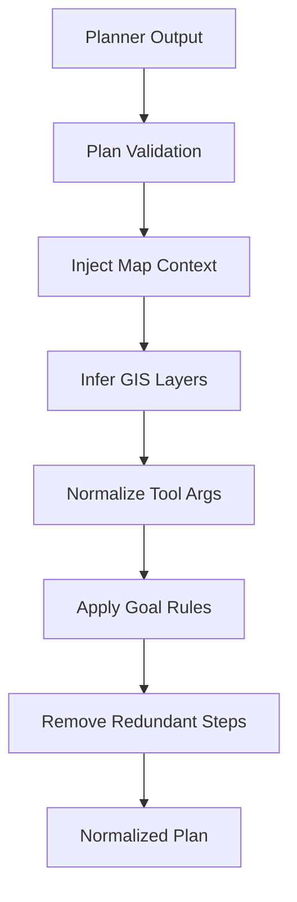

---

# GIS Layer Inference

El sistema puede inferir capas automáticamente.

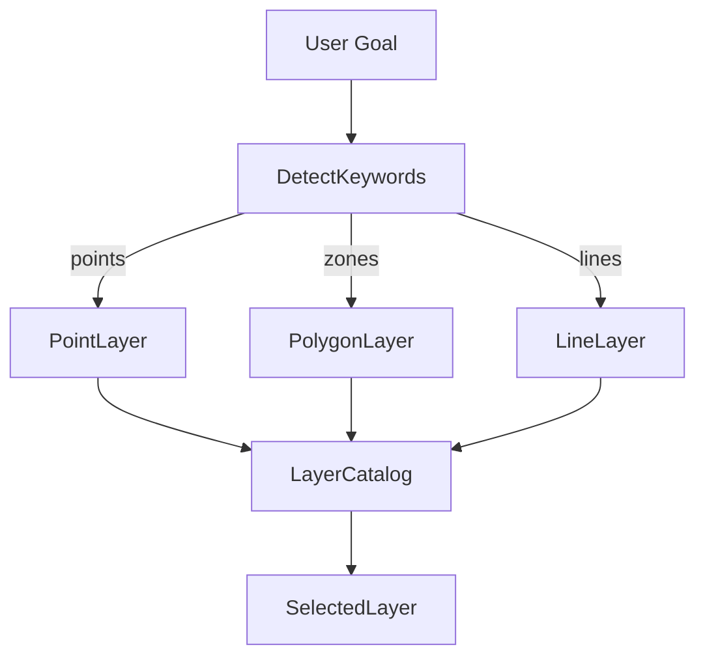

Esto permite que el agente no tenga que conocer los nombres exactos de las capas.

---

# Referencias entre pasos

GeoAgents soporta referencias entre outputs previos y args posteriores.

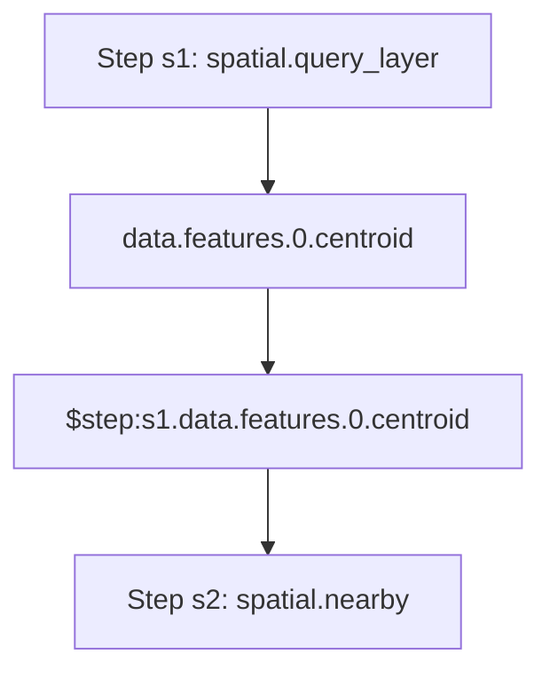

Esto permite un pipeline multi-tool real y trazable.

---

# Verificación por step

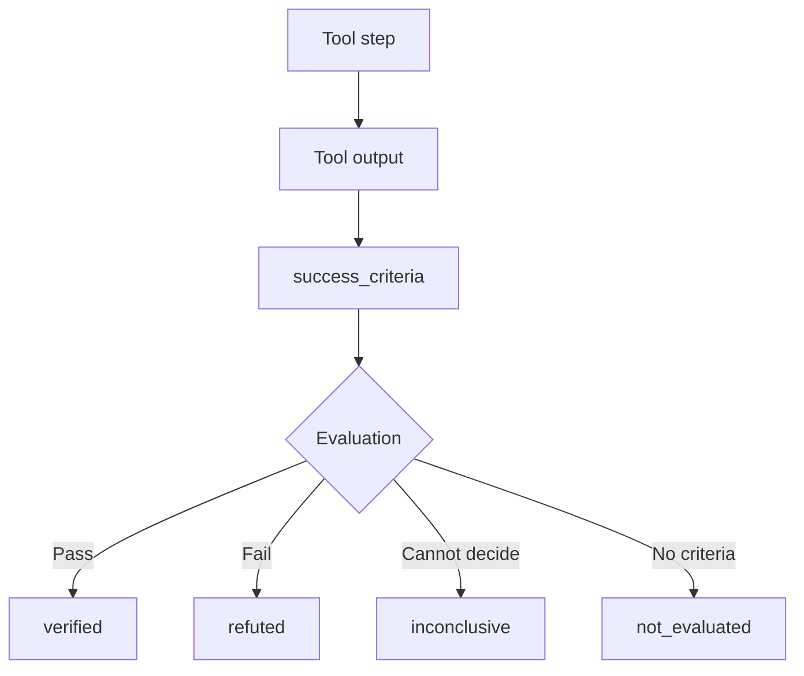

---

# Replan básico

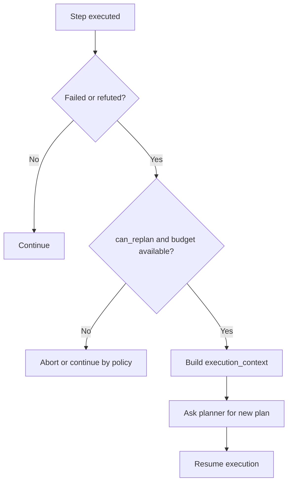

---

# Tool execution trace

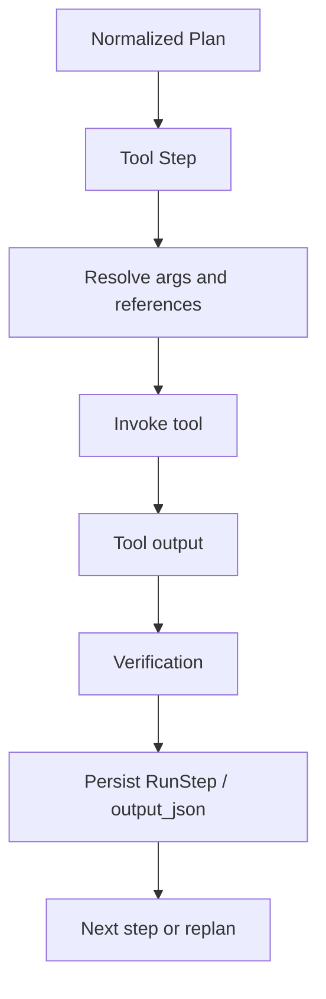

---

# Trace API view

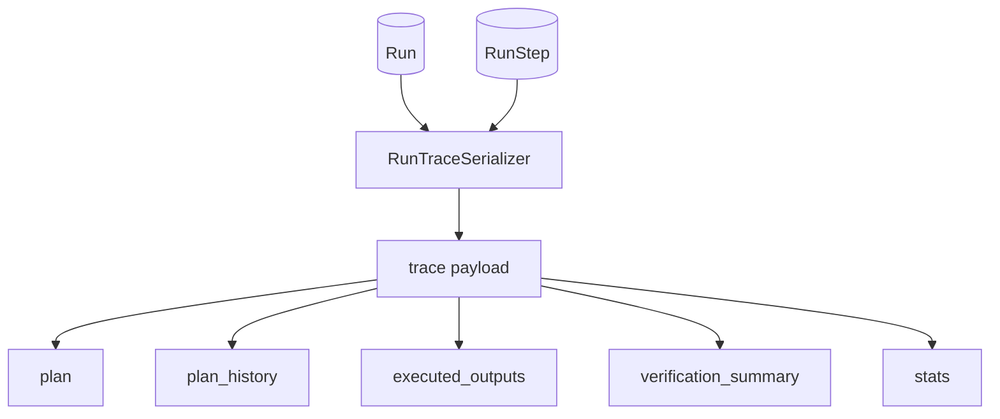

---

# Synthesizer Architecture

El synthesizer convierte los resultados en texto.

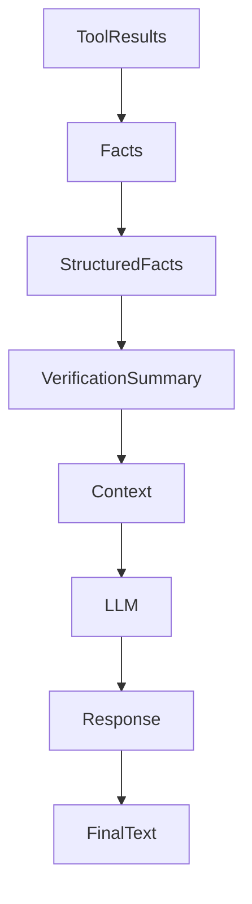

El synthesizer utiliza:

* facts estructurados
* resultados de tools
* verification summary
* el goal original

---

# Component map

Este diagrama muestra la arquitectura del framework como sistema modular.

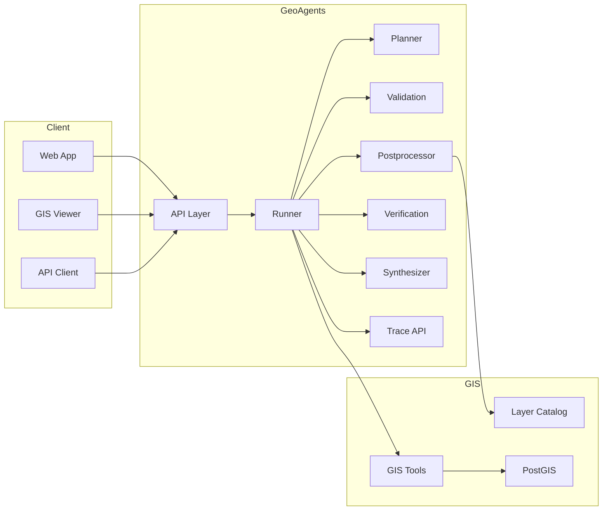

---

# Conceptual positioning

GeoAgents se sitúa conceptualmente en la siguiente categoría.

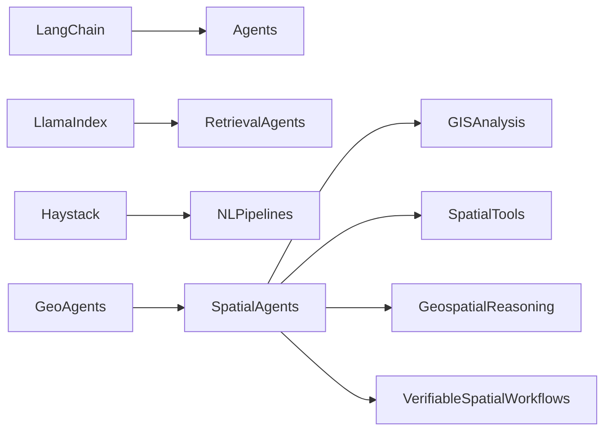

GeoAgents introduce razonamiento geoespacial estructurado con verificación y trazabilidad.

---

# Resumen conceptual

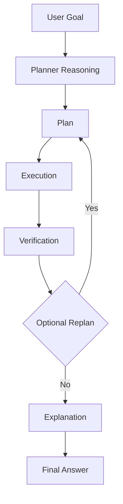

---

# Conclusión

GeoAgents combina:

* agentes IA
* herramientas GIS
* inferencia espacial
* verificación de hipótesis
* síntesis explicativa
* trazabilidad operativa

para crear un **motor de análisis geoespacial autónomo, trazable y extensible**.
